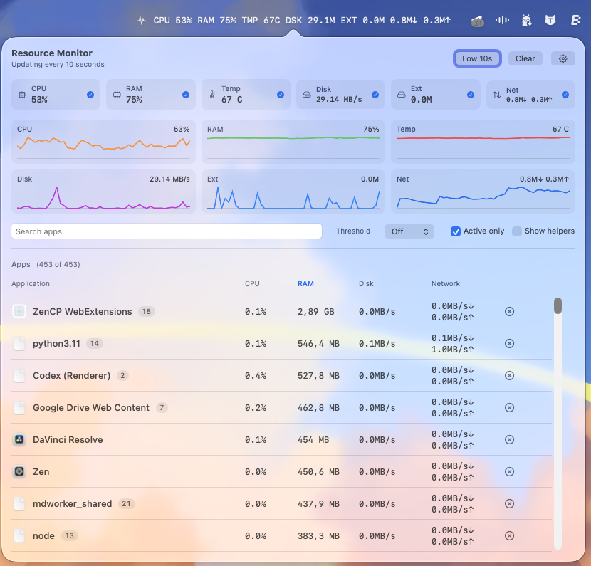

# MacResourceBar

Native macOS menu bar resource monitor for CPU, RAM, temperature, disk, external disk, network totals, and per-application activity.

[Download the latest DMG](https://github.com/klovinad/MacResourceBar/releases/download/v1.0/MacResourceBar-1.0.dmg)



MacResourceBar lives in your menu bar and opens a compact resource dashboard when you click it. It is built for quickly spotting what is using CPU, memory, disk, and network without opening Activity Monitor.

## Install

1. Download [`MacResourceBar-1.0.dmg`](https://github.com/klovinad/MacResourceBar/releases/download/v1.0/MacResourceBar-1.0.dmg).
2. Open the DMG.
3. Drag `MacResourceBar.app` into `Applications`.
4. Launch it from `Applications`.

The current public build is ad-hoc signed because no Apple Developer ID certificate is configured yet. macOS may show a Gatekeeper warning on first launch.

## Current MVP

- Menu bar status item with selectable system metrics:
  - Network download/upload
  - CPU
  - RAM
  - Disk activity
  - CPU temperature when available
  - External disk activity when available
- Left click opens the popover.
- Right click opens the context menu with launch-at-login, high refresh, show/hide, settings, and quit.
- High refresh samples totals, system metrics, and per-app data roughly every second.
- Low refresh slows total/system metrics and per-app monitoring to reduce overhead.
- Popover sparklines show recent network, CPU, RAM, and disk activity for the current app session.
- Settings window exposes persistent launch, refresh, tray metric, table filter, sort, and threshold preferences.
- Popover app table shows:
  - app icon/name
  - CPU
  - RAM
  - disk read/write
  - network down/up
- Table controls:
  - filters: All, CPU, Memory, Disk, Network
  - sort: Total, CPU, RAM, Disk, Network, Name
  - per-filter threshold picker
  - search by app name
  - Active only
  - Show helpers
- Terminating an app row asks for confirmation before sending `SIGTERM`.
- Helper grouping is best-effort. With Show helpers off, common Chrome, Electron, generic Helper, and WebKit/Safari helper rows are grouped under a parent app name where the process name makes that possible.

## Data Sources

- `NetworkTotalsMonitor`: public interface counters via `getifaddrs`.
- `NetworkProcessMonitor`: launches `/usr/bin/nettop` and parses delta CSV output for best-effort per-process network activity.
- `CPUProcessMonitor`: samples per-process CPU from `proc_pidinfo`.
- `MemoryProcessMonitor`: samples resident memory from `proc_pidinfo`.
- `DiskProcessMonitor`: samples per-process disk I/O from `proc_pid_rusage`.
- `AppResourceMonitor`: merges CPU/RAM/disk/network samples into `AppResourceSnapshot`.
- `SystemMetricsMonitor`: samples CPU, memory, disk, CPU temperature, and external disk activity.
- `AppSnapshotFilterState`: applies filtering, grouping, sorting, and thresholding for app rows.
- `MenuBarPreferences`: centralizes persisted `UserDefaults` keys and defaults.
- `MenuBarViewModel`: owns menu bar state, runtime history, monitor wiring, and menu bar formatting.

## Measurement Notes

- Per-app CPU is normalized to `0...100%` of total machine capacity, matching the system CPU scale shown in the menu bar. It is not Activity Monitor's `cores * 100` process scale.
- Total sort uses normalized activity points so RAM does not dominate CPU, disk, and network simply because memory is measured in large byte counts.
- Memory thresholds are byte counts.
- Disk and network thresholds are byte-per-second rates.
- All threshold is activity points.

## Limitations

- Per-app network attribution is best-effort because macOS does not expose a stable public API for live per-application network usage.
- `nettop` output can vary by OS version and may omit, delay, or rename process rows.
- The first `nettop` frame is discarded because it is a baseline, not an interval delta.
- CPU/RAM/disk process APIs are sampled for currently visible running applications; daemons and background agents are not the main MVP target.
- Helper grouping depends on process names and bundle metadata. It is intentionally heuristic.
- CPU temperature is best-effort and may be unavailable on some Macs or macOS versions.
- GPU monitoring is not part of the MVP.

## Build And Run

From this directory:

```bash
./script/build_and_run.sh --verify
```

The script builds the `NetworkMenuMonitor` Xcode scheme in Debug, launches `MacResourceBar.app`, and verifies that the process is running. The Codex app Run action is wired to the same script.

## Package DMG

To build a Release app bundle and compressed DMG:

```bash
./script/package_dmg.sh
```

The script writes `Release/MacResourceBar-1.0.dmg` and a copied app bundle at `Release/MacResourceBar.app`. Public internet distribution will still need Developer ID signing and notarization to avoid Gatekeeper warnings.

## Project Structure

```text
Network app/
├── .codex/environments/environment.toml
├── script/build_and_run.sh
├── script/package_dmg.sh
├── NetworkMenuMonitor.xcodeproj/
├── NetworkMenuMonitor/
│   ├── NetworkMenuMonitorApp.swift
│   ├── AppDelegate.swift
│   ├── Models/
│   │   ├── AppResourceSnapshot.swift
│   │   └── ResourceHistorySample.swift
│   ├── Services/
│   │   ├── AppResourceMonitor.swift
│   │   ├── CPUProcessMonitor.swift
│   │   ├── DiskProcessMonitor.swift
│   │   ├── LaunchAtLoginService.swift
│   │   ├── MemoryProcessMonitor.swift
│   │   ├── NetTopProcessMonitor.swift
│   │   ├── NetworkTotalsMonitor.swift
│   │   └── SystemMetricsMonitor.swift
│   ├── Utilities/
│   │   └── ByteRateFormatter.swift
│   ├── ViewModels/
│   │   ├── AppSnapshotFilterState.swift
│   │   ├── MenuBarPreferences.swift
│   │   └── MenuBarViewModel.swift
│   └── Views/
│       ├── MenuBarPopoverView.swift
│       └── SettingsView.swift
└── README.md
```

## Privacy

The MVP reads local system counters and process metadata on the Mac. It does not send telemetry or snapshots anywhere.

## Security

Please report security issues privately. See [SECURITY.md](SECURITY.md) for supported versions and reporting guidance.

## License

MacResourceBar is released under the [MIT License](LICENSE).
