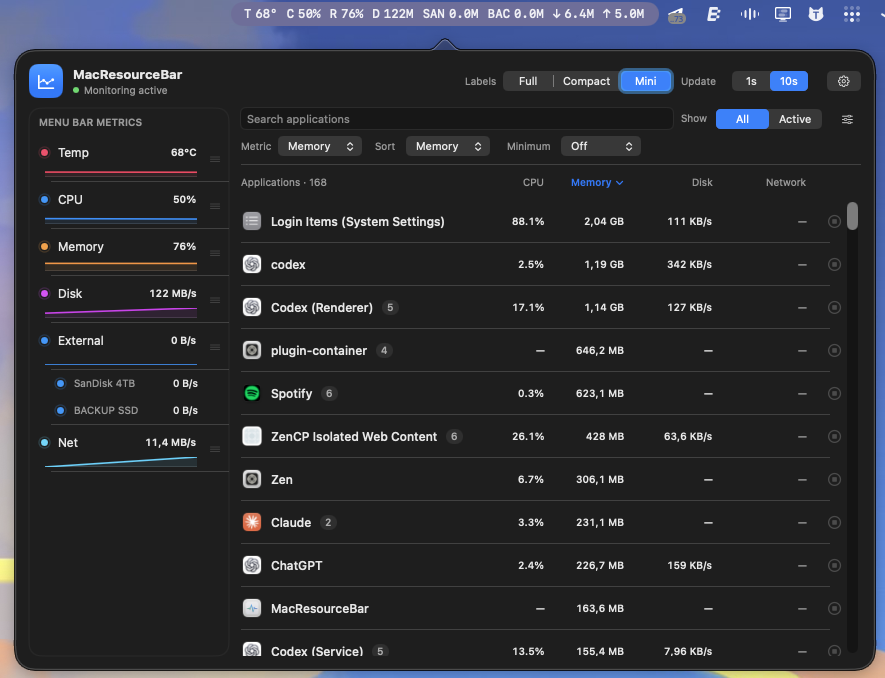

# MacResourceBar

Native menu bar resource monitor for macOS 13 or later, on Apple silicon and Intel. Monitor CPU, memory, temperature, internal and external disks, network totals, and application activity.

[Download the latest published release](https://github.com/klovinad/MacResourceBar/releases/latest)



MacResourceBar lives in your menu bar and opens a compact resource dashboard when you click it. It is built for quickly spotting what is using CPU, memory, disk, and network without opening Activity Monitor.

## Install

1. Download the current DMG from [GitHub Releases](https://github.com/klovinad/MacResourceBar/releases/latest).
2. Open the DMG.
3. Drag `MacResourceBar.app` into `Applications`.
4. Launch it from `Applications`.

The source tree targets **1.2 (build 5)**. The download link above points to the latest published version. Locally built DMGs are development artifacts; public DMGs require Developer ID signing and Apple notarization. See [the release process](RELEASE.md).

## Features

- Menu bar status item with selectable system metrics:
  - Network download/upload
  - CPU
  - RAM
  - Disk activity
  - CPU temperature when available
  - External disk activity when available
- Left click opens the popover.
- Two lines / Icons / Full / Compact / Mini can be selected directly in the popover header or Settings. The choice is saved between launches.
- Two lines stacks adjacent metrics in fixed-width columns and keeps network download/upload together. Icons uses a single row with larger values and SF Symbols. Both preserve metric order, disk identity and unavailable states.
- The 1 / 10 second refresh control remains directly in the popover header.
- Right click opens the context menu with launch-at-login, high refresh, show/hide, settings, and quit.
- High refresh samples system totals and per-app CPU, memory, and disk activity every second. Per-app network snapshots run every 5 seconds after a short warm-up.
- Low refresh uses 10-second intervals. Per-app monitoring stops when the popover closes. Temperature reads are limited to once every 5 seconds; disk inventory refreshes independently every 30 seconds and after mount changes.
- Popover sparklines show recent network, CPU, RAM, and disk activity for the current app session.
- The popover reuses its content between openings, suspends hidden updates, and creates application rows as they enter the viewport.
- Settings exposes launch, refresh, network source, tray metrics, external disks, table filters, sorting, memory pressure, compressed memory, and swap usage.
- Popover app table shows:
  - app icon/name
  - CPU
  - RAM
  - disk read/write
  - network down/up
- Table controls:
  - filters: All, CPU, Memory, Disk, Network
  - sort: Overall, CPU, Memory, Disk, Network, Name, Custom
  - real-unit threshold picker for CPU, Memory, Disk, and Network
  - search by app name
  - Active only
  - Show helpers
- Terminating an app row asks for confirmation, revalidates the process start identity to prevent PID reuse, and reports the result.
- Metrics can be reordered by dragging the full row, arrow keys, context menus, and accessibility actions.
- Missing or warming-up metrics display `N/A` instead of a false zero, including unavailable members of an application group.
- Helper grouping uses process ancestry and compatible bundle identities. Names alone never merge unrelated applications. Enable Show helpers to inspect individual processes.

## Data Sources

- `NetworkTotalsMonitor`: 64-bit interface counters via `NET_RT_IFLIST2`, scoped to the primary interface by default to avoid double-counting VPN traffic.
- `NetworkProcessMonitor`: takes bounded `/usr/bin/nettop` cumulative snapshots and validates CSV, process start identity, counter resets, and freshness. It never keeps a continuous nettop stream running.
- `CPUProcessMonitor`: samples per-process CPU and start identity together from `proc_pid_rusage`, converting Mach ticks to elapsed CPU time.
- `MemoryProcessMonitor`: samples physical footprint from `proc_pid_rusage`, with resident memory as a fallback.
- `DiskProcessMonitor`: samples per-process disk I/O from `proc_pid_rusage`.
- `AppResourceMonitor`: merges CPU/RAM/disk/network samples into `AppResourceSnapshot`.
- `SystemMetricsMonitor`: samples CPU, memory, disk, CPU temperature, and external disk activity.
- `AppSnapshotFilterState`: applies filtering, grouping, sorting, and thresholding for app rows.
- `MenuBarPreferences`: centralizes persisted `UserDefaults` keys and defaults.
- `MenuBarViewModel`: owns menu bar state, runtime history, monitor wiring, and menu bar formatting.

## Measurement Notes

- Per-app CPU follows Activity Monitor's process scale. One fully used logical core is 100%, so a multi-threaded process can exceed 100%. The system CPU metric remains a whole-machine value from 0% to 100%.
- Overall sort is a convenience ranking across available resources. Minimum filtering always uses a selected metric with real units.
- Memory thresholds are byte counts.
- Disk and network thresholds are byte-per-second rates.

## Limitations

- Per-app network attribution is best-effort because macOS does not expose a stable public API for live per-application network usage.
- `nettop` output can vary by OS version and may omit, delay, or rename process rows.
- The first `nettop` snapshot establishes a baseline. Rates become available after the next snapshot; closing connections can reset its best-effort counters.
- CPU/RAM/disk process APIs are sampled for currently visible running applications; daemons and background agents are not the main MVP target.
- Process ancestry can change, and inaccessible processes can make a grouped metric unavailable. Network attribution remains approximate, including traffic through a VPN.
- CPU temperature is best-effort and may be unavailable on some Macs or macOS versions.
- GPU monitoring is not part of the MVP.

## Build And Run

From this directory:

```bash
./script/build_and_run.sh --verify
```

Requires Xcode 16 or later. The script builds the `NetworkMenuMonitor` scheme first, asks existing MacResourceBar instances to quit normally, then launches and verifies the exact built bundle. It does not terminate processes by name. Use `--build-only` to build without touching the running app.

Run the regression suite with `swift test`. It covers native CPU/memory reads, 64-bit network counters, resets, PID reuse, nettop failure, grouping, filters, preference reload, and sampling during slow disk discovery.

For a read-only overhead measurement, pass the verified MacResourceBar PID to `swift script/measure_overhead.swift <pid> 30`. The output includes the app and its short-lived helper CPU usage. See [validation evidence](Docs/VALIDATION.md) for the latest local checks.

## Package DMG

To build a Release app bundle and compressed DMG:

```bash
./script/package_dmg.sh
```

The script writes `Release/MacResourceBar-1.2-local.dmg`, its SHA-256 checksum, and a copied app bundle at `Release/MacResourceBar.app`. The `-local` suffix makes the ad-hoc artifact impossible to confuse with a publishable build. See [RELEASE.md](RELEASE.md) for the Developer ID and notarized public flow.

## Project Structure

```text
Network app/
├── .github/workflows/build.yml
├── Package.swift
├── Tests/MacResourceBarCoreTests/
├── RELEASE.md
├── script/build_and_run.sh
├── script/package_dmg.sh
├── NetworkMenuMonitor.xcodeproj/
├── NetworkMenuMonitor/
│   ├── NetworkMenuMonitorApp.swift
│   ├── AppDelegate.swift
│   ├── Models/
│   │   ├── AppResourceSnapshot.swift
│   │   └── ResourceHistorySample.swift
│   ├── Services/
│   │   ├── AppResourceMonitor.swift
│   │   ├── CPUProcessMonitor.swift
│   │   ├── DiskProcessMonitor.swift
│   │   ├── LaunchAtLoginService.swift
│   │   ├── MemoryProcessMonitor.swift
│   │   ├── NetTopProcessMonitor.swift
│   │   ├── NetworkTotalsMonitor.swift
│   │   └── SystemMetricsMonitor.swift
│   ├── Utilities/
│   │   ├── ByteRateFormatter.swift
│   │   └── MonitoringPolicy.swift
│   ├── ViewModels/
│   │   ├── AppSnapshotFilterState.swift
│   │   ├── MenuBarPreferences.swift
│   │   └── MenuBarViewModel.swift
│   └── Views/
│       ├── MenuBarPopoverView.swift
│       └── SettingsView.swift
└── README.md
```

## Privacy

MacResourceBar reads local system counters and process metadata on the Mac. It does not send telemetry or snapshots anywhere.

## Security

Please report security issues privately. See [SECURITY.md](SECURITY.md) for supported versions and reporting guidance.

## License

MacResourceBar is released under the [MIT License](LICENSE).
